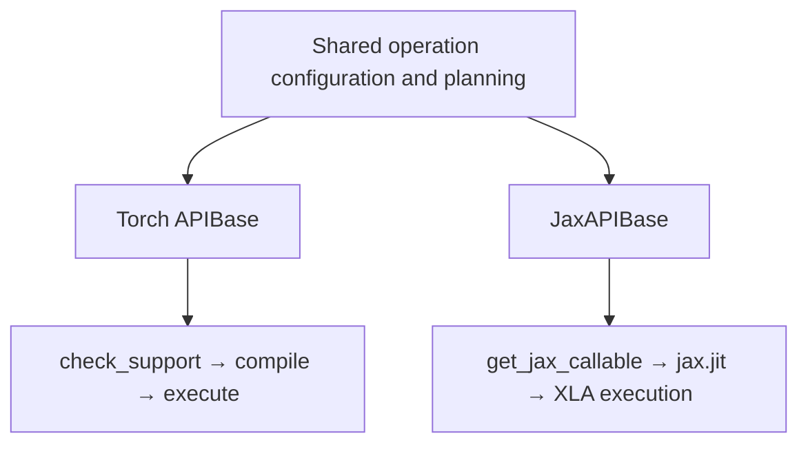

# APIBase and JAX Callable POC

Status: interview draft  
Branch: `mgoldfarb/cutedsl-jax-apibase-poc`

## Question

Can the existing object-oriented FE-OSS API and the JAX functional API share a
useful abstraction without making Torch a dependency of JAX?

Yes, but they should not share the `compile()` / `execute()` lifecycle. The
current [`APIBase`](../../python/cudnn/api_base.py) is an eager Torch API: it
captures sample tensor descriptors, creates fake CuTe tensors, compiles a
callable, owns compiled state, accepts preallocated outputs, and selects a CUDA
stream. JAX instead needs a plain function that validates abstract values while
tracing, describes XLA-owned outputs and workspace, and lets `jax.jit` and
`cutlass.jax.cutlass_call` own lowering and execution.

The POC should align the operation model while preserving different backend
lifecycles.

## Proposed split



### Common operation layer

Share concrete operation logic through composition or free functions, not by
forcing the backends through one lifecycle:

- immutable/static operation configuration;
- target-independent shape and static-configuration support predicates;
- launch-parameter resolution;
- logical output and workspace shape formulas;
- kernel launcher construction where it is genuinely framework-neutral.

Active-device and SM capability checks remain backend-specific. Torch can
inspect its eager CUDA device; JAX target capability is resolved during
lowering/CUTLASS compilation or against an explicit static target, not by
querying a tracer or `jax.devices()` inside the callable.

Do not initially introduce a universal tensor or buffer model. Torch
`TensorDesc`, `torch.dtype`, `torch.device`, `cutlass.jax.TensorSpec`, and the
JAX adapter's `BufferSpec` have different jobs. A neutral `OperationPlan` should
only be added after two operations demonstrate the same missing abstraction.

### Torch layer

Keep the existing `APIBase` name and public behavior unchanged:

- constructor sample tensors and Torch `TensorDesc`;
- persistent `_is_supported` and `_compiled_kernel` state;
- `check_support()`, `compile()`, `execute()`, and compile-on-call behavior;
- Torch dtype/layout helpers and fake CuTe tensor construction;
- eager stream selection.

Output allocation conventions and cached workspace belong to individual Torch
operation adapters, not to `APIBase`; a common base should not add a workspace
ownership contract.

The current class is imported by many operations and also imports Torch at
module scope. JAX code must not import it.

### JAX layer

Place an independent base in `cudnn/jax/api_base.py`:

```python
class JaxAPIBase(ABC):
    def __init__(self):
        self._jax_callable = None

    def get_jax_callable(self):
        if self._jax_callable is None:
            self._jax_callable = self._build_jax_callable()
        return self._jax_callable

    @abstractmethod
    def _build_jax_callable(self): ...
```

The JAX object captures static configuration only. It does not capture sample
arrays, streams, output buffers, workspace, jitted executables, or a sticky
support flag. `get_jax_callable()` returns a stable, plain function identity;
the caller decides whether and how to apply `jax.jit`, donation, or device
placement. The object does not choose or cache sharding, but each operation
must still document and enforce the sharding patterns it supports.

Compile-affecting configuration must be immutable after construction or copied
into closure locals when the callable is built. Mutating captured state behind
a stable function identity could let JAX reuse an executable with stale
semantics. If callables are constructed lazily, identity stability under
concurrent access also needs synchronization.

Support is checked per trace because one callable can be traced for multiple
abstract signatures. A JAX `compile()` alias would be misleading: JAX
compilation depends on the abstract arguments and `jax.jit` options owned by
the application. `_build_jax_callable()` may validate captured static
configuration once, but every input-dependent shape and dtype check stays
inside the returned function so it runs for each new abstract trace.

## Candidate public shape

The existing functional API remains available:

```python
from cudnn.jax import rmsnorm_rht_amax_sm100

result = jax.jit(rmsnorm_rht_amax_sm100)(x, weight)
```

The object POC could add the same operation class name under the explicit JAX
namespace without colliding with Torch:

```python
from cudnn.rmsnorm_rht_amax import jax as rmsnorm_jax

operation = rmsnorm_jax.RmsNormRhtAmaxSm100(
    eps=1e-5,
    num_threads=None,
    rows_per_cta=None,
)
fn = operation.get_jax_callable()
result = jax.jit(fn)(x, weight)
```

The module-level JAX function can delegate to the same callable implementation
so the class does not become mandatory.

## Is a common Python base worthwhile?

Only a small part of `APIBase` is dependency-neutral today:

- logger creation and experimental warnings;
- `_value_error_if`, `_runtime_error_if`, and
  `_not_implemented_error_if`.

Everything else carries Torch metadata or eager lifecycle semantics. There are
two reasonable POC choices:

1. Leave `APIBase` untouched and make `JaxAPIBase` independent. Extract common
   code only after the object POC demonstrates meaningful reuse.
2. Add a stdlib-only `CommonAPIBase` for diagnostics, then derive the existing
   Torch `APIBase` and new `JaxAPIBase` from it.

The first choice is lower risk. The second demonstrates a shared hierarchy but
may be abstraction for only a logger and three one-line helpers.
If the second choice is selected, it should also consolidate the currently
duplicated experimental-warning registry while preserving its thread-safe,
one-warning-per-API behavior.

## POC scope

Use two existing operations:

1. RMSNorm + RHT + amax proves static configuration, output inference, stable
   callable identity, and preservation of the existing Torch class.
2. Indexer Top-K proves that workspace remains backend-owned: Torch may cache
   allocations, while JAX exposes it only as a hidden XLA result.

Suggested implementation order:

1. Add `JaxAPIBase` without changing Torch `APIBase`.
2. Add a static-config JAX object for RMSNorm while retaining the function.
3. Make Torch and JAX consume the existing RMSNorm launch-config resolver.
4. Add Indexer Top-K to test hidden workspace and per-signature validation.
5. Review the resulting duplication before introducing `CommonAPIBase` or a
   neutral plan type.

## Required tests

- Import and use the JAX object with Torch blocked.
- Repeated `get_jax_callable()` calls return the same function object.
- Compile-affecting configuration cannot mutate after callable construction,
  or the callable demonstrably uses an immutable snapshot.
- Constructing the object performs no CuTe compilation and allocates no device
  buffers.
- `jax.eval_shape`, `jax.jit(...).lower(...)`, compiled execution, and numerical
  comparison work on supported hardware.
- Different abstract signatures are validated independently.
- Top-K workspace is not public and is not retained on the JAX object.
- Concurrent calls do not share mutable output or workspace state.
- Existing Torch constructors, `compile()`, `execute()`, wrappers, and tests are
  unchanged.

## Decisions for the interview

1. Is the JAX operation object public, or is `JaxAPIBase` only an internal
   implementation behind the existing functional API?
2. Does the object expose only `get_jax_callable()`, or also `__call__` as a
   convenience for un-jitted/traced invocation?
3. Should the first POC extract `CommonAPIBase`, or leave Torch `APIBase`
   untouched until there is proven shared behavior?
4. Does a JAX object bind only static configuration, or also a fixed abstract
   input signature such as `ShapeDtypeStruct`?
5. Should the returned callable always be plain, or should a convenience method
   return a pre-jitted function? The draft recommends plain only.
6. Is RMSNorm plus Indexer Top-K the right scope, or should the first POC stop
   after RMSNorm?
